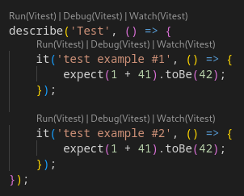

# vscode-vitest

Vitest runner for vscode that actually works

### Run/Watch/debug any test (`it`, `test`, or `describe`) in `.js`, `.ts`, `.jsx`, or `.tsx` files:

  


## Extension Settings

| Command                           | Description                              | Examples                                                                   | Default                                    |
| --------------------------------- | ---------------------------------------- | -------------------------------------------------------------------------- | ------------------------------             |
| `vscode-vitest.pretest`           | Any command(s) to run before actual test | `["npm run script1", "npm run script2"` (will run in the given order)      | []                                         |
| `vscode-vitest.packageManager`    | Desired package manager                  | `npm`, `yarn`, `pnpm`, `pnpx`, etc                                         | `npx`                                      |
| `vscode-vitest.testCommand`       | Define an alternative vitest command     | `test` (e.g. for CRA, package.json `test` script, or similar abstractions) | `vitest`                                   |
| `vscode-vitest.extraArguments`    | Any additional vitest arguments          |  `--silent=true --maxWorkers=2`                                            | `""`                                       |
| `vscode-vitest.executableOptions` | Executable option to show                |  `{"debug": false, "run": false}` (will only display `watch`)              | `{"debug": true,"run": true, "run": true}` |


### Example Settings:
```
  "vscode-vitest.pretest": ["npm run script1"],
  "vscode-vitest.packageManager": "pnpm",
  "vscode-vitest.testCommand": "test",
  "vscode-vitest.extraArguments": "--silent --maxWorkers=2",
  "vscode-vitest.executableOptions": {
    "debug": false,
    "watch": false
  },
```